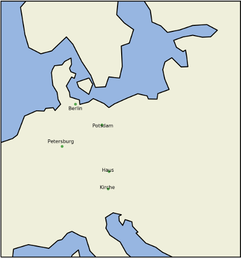

geokelone: work in progress
==============================================

.. image:: https://img.shields.io/pypi/v/geokelone.svg
    :target: https://pypi.python.org/pypi/geokelone

.. image:: https://img.shields.io/pypi/l/geokelone.svg
    :target: https://pypi.python.org/pypi/geokelone

.. image:: https://img.shields.io/pypi/pyversions/geokelone.svg
    :target: https://pypi.python.org/pypi/geokelone

.. image:: https://img.shields.io/travis/adbar/geokelone.svg
    :target: https://travis-ci.org/adbar/geokelone

.. image:: https://img.shields.io/codecov/c/github/adbar/geokelone.svg
    :target: https://codecov.io/gh/adbar/geokelone

``Geokelone`` is an effort to integrate spatial and textual data processing tools into a modular software package which features preprocessing, geocoding, disambiguation and visualization.

Only Python3 (especially 3.4 onwards) is supported, although the scripts may work for Python 2.7.

Current source for more information: Barbaresi, A. (2017). Towards a toolbox to map historical text collections, *Proceedings of 11th Workshop on Geographic Information Retrieval*, ACM, Heidelberg.

.. contents:: **Contents**
    :backlinks: none

Installation on Linux
---------------------

Proj library
~~~~~~~~~~~~

The `proj library <https://github.com/OSGeo/proj.4/>`_ is needed. There are several ways to install it:

- From a package repository (preferably posterior to 2016)

  - there are several options (*libproj0* or *libproj9* or *libproj12*), to let the system decide:
  - ``apt-get install libproj-dev proj-data proj-bin``

- From source:

  a. ``wget http://download.osgeo.org/proj/proj-4.9.3.tar.gz``
  b. ``tar -xzvf proj-4.9.3.tar.gz``
  c. ``cd proj-4.9.3 && ./configure --prefix=/usr && make && sudo make install``

Other packages
~~~~~~~~~~~~~~

-  ``apt-get install libgeos-* libgeos-dev libffi-dev libgdal-dev libxslt1-dev``

Python packages
~~~~~~~~~~~~~~~

Two options, from system repositories or through ``pip``:

- *python3-dev python3-shapely python3-gdal python3-matplotlib python3-pyproj python3-shapely*
- or simply ``pip3 install cairocffi GDAL matplotlib pyproj shapely``

Cartopy install notes
~~~~~~~~~~~~~~~~~~~~~

Finally, *cartopy* can be installed:

- ``pip3 install cartopy``
- or on newer systems: ``apt-get install python3-cartopy`` cf `<https://packages.ubuntu.com/source/zesty/python-cartopy>`_
- or see here: `<http://scitools.org.uk/cartopy/docs/latest/installing.html#installing>`_

Install this package
~~~~~~~~~~~~~~~~~~~~

Direct installation of the latest version over pip is possible:

-  ``pip3 install git+https://github.com/adbar/geokelone.git``

Usage
-----

Bootstrapped geographic databases
~~~~~~~~~~~~~~~~~~~~~~~~~~~~~~~~~

Data helpers are included to derive geographic data from existing sources such as Geonames, Wikipedia or Wikidata, see for example Geonames with country codes:

.. code-block:: python

    >>> from geokelone import data
    >>> codesdict = dict()
    >>> metainfo = dict()
    # decide countries for which Geonames information is downloaded
    >>> countries = ['da', 'fi'] # 2-letter country code
    # go fetch the data
    >>> data.fetchdata(countries, codesdict, metainfo)
    # write files for further use
    >>> data.writefile(codesdict, 'geonames-codes.dict')
    >>> data.writefile(metainfo, 'geonames-meta.dict')

Extraction, disambiguation and mapping
~~~~~~~~~~~~~~~~~~~~~~~~~~~~~~~~~~~~~~

.. code-block:: python

    >>> from geokelone import data, geo, text
    # read from a tagged text (one token per line)
    >>> splitted = text.readfile.readtagged('tests/data/fontane-stechlin.tagged')
    # load default gazetteer info (Geonames, see above)
    >>> metainfo = data.load.geonames_meta('geonames-meta.dict')
    >>> codesdict = data.load.geonames_codes('geonames-codes.dict', metainfo)
    # search for place names and store a list of resolved toponyms with metadata
    >>> results = geo.geocoding.search(splitted, codesdict, metainfo)
    # write the results to a file
    >>> text.outputcontrol.writefile('test.out', results, dict())
    # draw a map
    >>> geo.mapping.draw_map('testmap.png', results)

Why disambiguate?
~~~~~~~~~~~~~~~~~

Did you know there was a Jerusalem in Bavaria and a Leipzig in Ukraine?

Why curate special registers or gazetteers?
~~~~~~~~~~~~~~~~~~~~~~~~~~~~~~~~~~~~~~~~~~~

Even with a touch of filtering, the token "Berlin" in Geonames is a place north of Germany with 0 inhabitants, see map below:

Extension of gazetteers
~~~~~~~~~~~~~~~~~~~~~~~

The helper function in ``data.load.load_tsv()`` allow for additional registers to match particular needs, with particular levels (0 to 3), for example:

.. code-block:: python

    >>> from geokelone import data
    # read from a TSV-file with three columns: name, latitude, longitude
    >>> customized = data.load.load_tsv('file-X.tsv')
    # read from a CSV-file with optional level option (additional metadata)
    # four columns expected: name, canonical name, latitude, longitude
    >>> customized = data.load.load_csv('file-Y.csv', level=1)
    >>> results = geo.geocoding.search(splitted, codesdict, metainfo, customized)

Using Wikipedia to build custom lists
~~~~~~~~~~~~~~~~~~~~~~~~~~~~~~~~~~~~~

The module includes helpers to navigate categories, for example the `World Heritage Sites in England <https://en.wikipedia.org/wiki/Category:World_Heritage_Sites_in_England>`_ or the `Cultural Landscapes of Japan <https://en.wikipedia.org/wiki/Category:Cultural_Landscapes_of_Japan>`_ and to fetch coordinates for a given list by querying Wikipedia.

.. code-block:: python

    >>> from geokelone import wikipedia
    # chained operations for a list of categories
    >>> wikipedia.process_todolist('mytodolist.txt', outputfile='solved.tsv', categories=True)
    # discover entries in a category
    >>> category_members = wikipedia.navigate_category('XYZ')
    # process them one by one
    >>> for member in category_members:
    >>>     lat, lon = find_coordinates(member, language='de')
    >>>     print(member, lat, lon)

Special parameters
~~~~~~~~~~~~~~~~~~

A series of parameters can be set to affect both search and visualization, see ``settings.py`` file.

TODO
----

- provide map configuration
- integrate named entity recognition tool from Python repositories
- add more import and export filters
- write more tests
- documentation

Integration
-----------

For a language-independent solution in the Python world, I would suggest `polyglot <https://github.com/aboSamoor/polyglot>`_.

References
----------

Uses of the code base so far:

- Barbaresi, A. (2016). `Visualisierung von Ortsnamen im Deutschen Textarchiv <https://halshs.archives-ouvertes.fr/halshs-01287931/document>`_. In DHd 2016, pages 264-267. Digital Humanities im deutschprachigen Raum eV.
- Barbaresi, A. and Biber, H. (2016). `Extraction and Visualization of Toponyms in Diachronic Text Corpora <https://hal.archives-ouvertes.fr/hal-01348696/document>`_. In Digital Humanities 2016, pages 732-734.
- Barbaresi, A. (2017). `Toponyms as Entry Points into a Digital Edition: Mapping Die Fackel (1899-1936) <https://dh2017.adho.org/abstracts/209/209.pdf>`_. In Digital Humanities 2017, pages 159-161.
- Barbaresi, A. (2017). "Towards a toolbox to map historical text collections", *Proceedings of 11th Workshop on Geographic Information Retrieval*, ACM, Heidelberg.
- Barbaresi A. (2018). A constellation and a rhizome: two studies on toponyms in literary texts. In *Visual Linguistics*, Bubenhofer N. & Kupietz M. (Eds.), Heldelberg University Publishing, to appear.

Additional info
---------------

Why *geokelone*? `Because <https://en.wikipedia.org/wiki/Geochelone>`_.

**Work in progress**, see legacy page for more information: `<https://github.com/adbar/toponyms>`_
